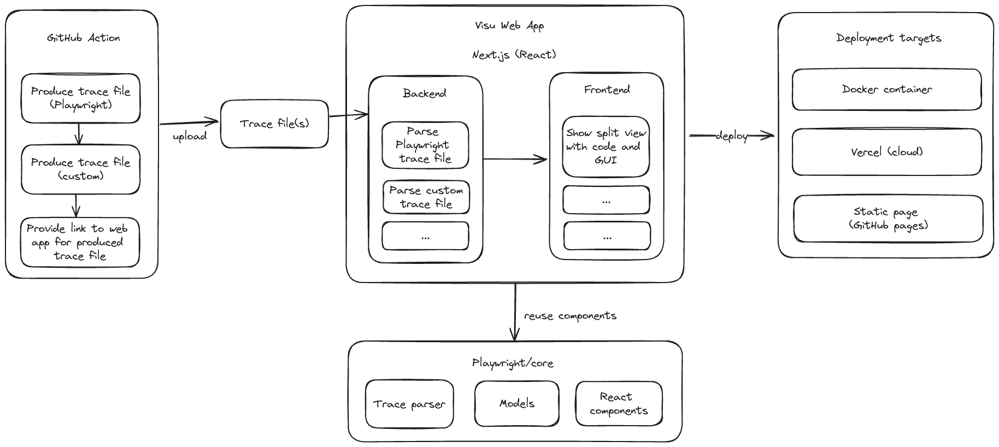

# Visual Test Review

Visualizing GUI-based tests for Code Reviews

## Architecture

The following diagram shows an overview of the planned architecture.
It will be updated as the project progresses and the requirements are gathered.

## Frontend

See [frontend](./frontend) folder.

## License

Copyright © 2024 Andreas Bauer

This work (source code) is licensed under the [Apache-2.0](./LICENSE) license.
